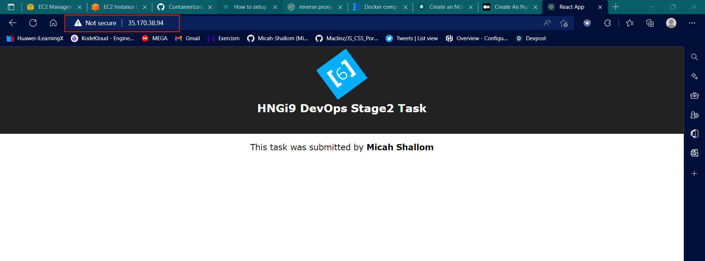

# Devops-Django-React-Task





## Backend development workflow

```json
virtualenv env
source env/bin/activate
pip install -r requirements.txt
python manage.py runserver
```

## Frontend development workflow

You are to update your name in ./frontend/components/App.js

```json
npm i
npm start
```

## For deploying

```json
npm run build
```

